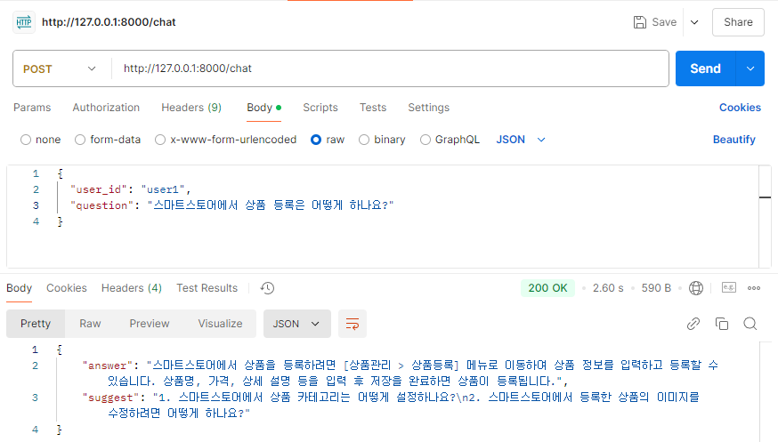
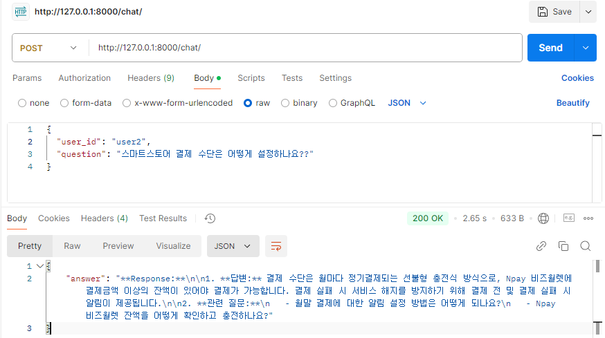
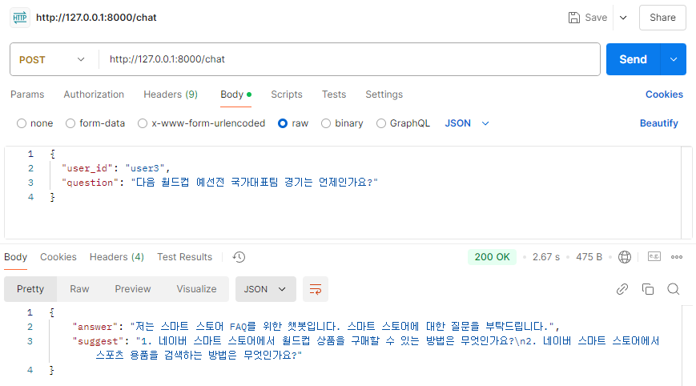

# 스마트스토어 FAQ 챗봇

이 프로젝트는 스마트스토어와 관련된 질문에 대해 FAQ 데이터를 기반으로 자동으로 답변하는 챗봇 시스템입니다. 사용자 질문을 처리하고, 관련된 FAQ 질문을 찾고, 그에 대한 답변을 OpenAI 모델을 통해 생성하여 제공합니다.

## 문제 접근 방법

- **전처리 방법**:  
  사용자 질문에 대한 전처리를 통해 불용어(stopwords)를 제거하고, 텍스트를 토큰화하여 유사도 측정의 정확도를 높였습니다. 정규표현식을 사용해 불용어를 제거하고, 의미 있는 단어들만 추출하여 처리했습니다.

- **비동기 방식**:  
  OpenAI API 호출 시 비동기 방식(`async/await`)을 사용하여 응답 속도를 최적화하고, 빠른 응답을 제공합니다.

- **프롬프트 작성 방법**:  
  OpenAI의 응답을 생성할 때 FAQ에서 찾은 답변을 프롬프트에 포함시켜 더 정확한 답변을 유도했습니다. 질문과 관련된 충분한 정보를 제공하고, 한국어로 명확한 답변을 생성하도록 했습니다.

- **대화 기록 저장 방법**:  
  사용자의 대화 기록을 JSON 파일(`conversation_history.json`)에 저장하여 이전 대화 내용을 유지하고, 같은 사용자에 대해 더 적합한 답변을 제공할 수 있습니다.

- **스마트스토어 관련없는 질문 판별 방법**:  
  사용자 질문과 FAQ 데이터 간의 유사도를 계산하여, 유사도가 일정 기준 이하일 경우 "저는 스마트 스토어 FAQ를 위한 챗봇입니다. 스마트 스토어에 대한 질문을 부탁드립니다."라는 메시지를 반환합니다.

## 핵심 코드 설명

1. **`rag.py`**  
   사용자 질문과 FAQ 질문들 간의 유사도를 계산하여, 가장 관련 있는 FAQ 질문을 찾습니다. `SentenceTransformer` 모델을 사용하여 질문을 벡터화하고, 이를 기반으로 유사도를 계산합니다.

2. **`openai_api.py`**  
   OpenAI API를 사용하여 사용자 질문에 대한 답변을 생성합니다. `processed_query`와 `context`를 포함하여 프롬프트를 생성하고, 이를 통해 OpenAI 모델에 요청을 보냅니다.

3. **`stopword_processor.py`**  
   사용자 정의 불용어를 추가하거나 수정할 수 있는 기능을 제공합니다. 기본적으로 스마트스토어 관련 단어들이 불용어로 설정되어 있으며, 추가적인 불용어도 포함할 수 있습니다.

## 프로젝트 구조
```bash
project/
│
├── faq_bot/
│   ├── faq_data_load.py         # pkl 파일에서 FAQ 데이터를 불러오는 함수
│   ├── openai_api.py            # 비동기적으로 OpenAI API를 통해 답변을 생성하는 함수
│   ├── stopword_processor.py    # 불용어 처리 함수 및 관련 코드
│   └── rag.py                   # SentenceTransformer를 사용하여 질문 간 유사도를 측정하는 함수
│
├── data/
│   ├── final_result.pkl         # FAQ 질문과 답변 데이터
│   ├── conversation_history.json# 사용자별 대화 기록
│   └── test_question.txt        # 테스트 케이스를 넣어둔 텍스트 파일
│
├── main.py                      # FastAPI 애플리케이션 코드
├── requirements.txt             # 프로젝트 의존성
├── README.md                    # 프로젝트 설명서
├── test.py                      # 테스트 코드 파일
└── LICENSE                      # MIT 라이센스 파일
```
## 질의응답 데모

## 코드 실행 방법

1. **필요한 의존성 설치**  
   먼저 `requirements.txt`에 정의된 의존성들을 설치합니다.

```bash
pip install -r requirements.txt
```

## 질의응답 데모

아래는 질의응답 데모의 결과 이미지입니다.


### 결과 1


### 결과 2


### 결과 3



이 이미지는 각기 다른 질문에 대한 답변과 관련 질문 제안 과정을 보여줍니다.

## 코드 실행 방법

1. **필요한 의존성 설치**  
먼저 `requirements.txt`에 정의된 의존성들을 설치합니다.
```bash
pip install -r requirements.txt
```


2. **FastAPI 서버 실행**  
FastAPI 서버를 실행합니다.
```bash
python main.py

```

3. **Swagger UI로 API 테스트**  
브라우저에서 `http://localhost:8000/docs`로 접속하여 Swagger UI에서 API를 테스트할 수 있습니다.

4. **`test.py`를 사용하여 API 테스트**  
`test.py` 파일을 사용하여 API를 자동으로 테스트할 수 있습니다. `test.py`에는 여러 테스트 케이스가 포함되어 있으며, FastAPI의 테스트 클라이언트를 사용하여 API의 동작을 검증합니다. 

`test.py`를 실행하려면 다음 명령어를 사용합니다.
```bash
python test.py
```

## 라이센스
이 프로젝트는 MIT 라이센스를 따릅니다. 자세한 내용은 LICENSE 파일을 참조해주세요.