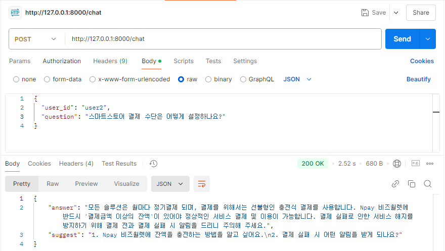

# 스마트스토어 FAQ 챗봇

이 프로젝트는 스마트스토어와 관련된 질문에 대해 FAQ 데이터를 기반으로 자동으로 답변하는 챗봇 시스템입니다. 사용자 질문을 처리하고, 관련된 FAQ 질문을 찾고, 그에 대한 답변을 OpenAI 모델을 통해 생성하여 제공합니다.

## 문제 접근 방법

- **전처리 방법**:  
  사용자 질문에 대한 전처리를 통해 불용어(stopwords)를 제거하고, 텍스트를 토큰화하여 유사도 측정의 정확도를 높였습니다. 정규표현식을 사용해 불용어를 제거하고, 의미 있는 단어들만 추출하여 처리했습니다.

- **유사도 측정 모델**:  
  FAQ 데이터와 사용자 질문 간의 유사도 측정을 위해 정확도가 높은 SentenceTransformer 기반의 사전학습된 모델을 사용했습니다. 이를 통해 높은 정확도로 질문의 의도를 파악하고 적절한 FAQ 응답을 선택할 수 있도록 구현했습니다.

- **비동기 방식**:  
  OpenAI API 호출 시 비동기 방식(`async/await`)을 사용하여 응답 속도를 최적화하고, 빠른 응답을 제공합니다.

- **프롬프트 작성 방법**:  
  OpenAI의 응답을 생성할 때, 질문과 FAQ 데이터의 유사도에 따라 프롬프트를 다르게 작성하여 보다 정확하고 유용한 답변을 제공하도록 설계했습니다.
  또한, 템플릿을 사용하여 답변과 관련 질문을 명확히 구분하였습니다. 이를 통해 OpenAI가 생성한 텍스트를 손쉽게 파싱하고 구조적으로 반환할 수 있도록 하였습니다.

    #### 유사도가 낮은 경우  
    FAQ 데이터에서 관련 답변을 찾지 못한 상황을 대비하여, 사용자 질문을 기반으로 **네이버 스마트 스토어 FAQ와 연관된 두 가지 질문을 제안**하도록 프롬프트를 작성했습니다. 이때 다음 요소를 포함했습니다:  
    - 사용자의 질문과 FAQ 간 유사도가 낮음을 명시.  
    - 네이버 스마트 스토어 FAQ와의 연관성을 유지하며, 사용자 관심사를 반영한 추가 질문을 제안.
    - 템플릿을 활용하여 관련 질문 목록을 명확하게 제공.
      ```
      Related Questions:
      1. [Provide the first related question here]
      2. [Provide the second related question here]
      ```

    #### 유사도가 높은 경우  
    FAQ에서 적절한 답변을 찾은 경우, 이를 기반으로 **정확한 답변**과 함께 **관련된 두 가지 질문**을 추가적으로 제공하도록 설계했습니다.  
    - FAQ 데이터를 참고하여 사용자의 질문에 대한 간결하고 정확한 답변을 생성.  
    - 질문과 맥락을 고려해 연관성 높은 추가 질문을 제안.
    - 템플릿을 사용하여 답변과 추가 질문을 구조적으로 반환.
      ```
      Answer: [Provide the concise and accurate response here]
      Related Questions:
      1. [Provide the first related question here]
      2. [Provide the second related question here]
      ```

- **대화 기록 저장 방법**:  
  사용자의 대화 기록을 JSON 파일(`conversation_history.json`)에 저장하여 이전 대화 내용을 유지하고, 같은 사용자에 대해 더 적합한 답변을 제공할 수 있습니다.

- **스마트스토어 관련없는 질문 판별 방법**:  
  사용자 질문과 FAQ 데이터 간의 유사도를 계산하여, 유사도가 일정 기준 이하일 경우 "저는 스마트 스토어 FAQ를 위한 챗봇입니다. 스마트 스토어에 대한 질문을 부탁드립니다."라는 메시지를 반환합니다.

## 핵심 코드 설명

1. **`rag.py`**  
   사용자 질문과 FAQ 질문들 간의 유사도를 계산하여, 가장 관련 있는 FAQ 질문을 찾습니다. `SentenceTransformer` 모델을 사용하여 질문을 벡터화하고, 이를 기반으로 유사도를 계산합니다.

2. **`openai_api.py`**  
   OpenAI API를 사용하여 사용자 질문에 대한 답변을 생성합니다. `processed_query`와 `context`를 포함하여 프롬프트를 생성하고, 이를 통해 OpenAI 모델에 요청을 보냅니다.

3. **`stopword_processor.py`**  
   사용자 정의 불용어를 추가하거나 수정할 수 있는 기능을 제공합니다. 기본적으로 스마트스토어 관련 단어들이 불용어로 설정되어 있으며, 추가적인 불용어도 포함할 수 있습니다.

## 프로젝트 구조
```bash
├── faq_bot
│   ├── __init__.py
│   ├── application
│   │   ├── README.md
│   │   └── chat_service.py
│   ├── domain
│   │   ├── README.md
│   │   ├── conversation.py
│   │   ├── faq_service.py
│   │   └── question_handler.py
│   └── infrastructure
│       ├── README.md
│       ├── db_adapter.py
│       ├── openai_adapter.py
│       ├── rag.py
│       └── stopword_processor.py
├── insert_mongodb.py
├── main.py
├── test.py
```

## 질의응답 데모

아래는 질의응답 데모의 결과 이미지입니다.


### 결과 1


### 결과 2


### 결과 3


이 이미지는 각기 다른 질문에 대한 답변과 관련 질문 제안 과정을 보여줍니다.

## 코드 실행 방법

1. **필요한 의존성 설치**  
   먼저 `requirements.txt`에 정의된 의존성들을 설치합니다.

    ```bash
    pip install -r requirements.txt
    ```
2. **FastAPI 서버 실행**  
    FastAPI 서버를 실행합니다.
    ```bash
    python main.py

    ```
3. **Postman 또는 cURL을 사용하여 API 테스트**  
   Postman이나 cURL을 사용하여 API를 테스트할 수 있습니다. 다음은 cURL을 사용한 예시입니다:

   ```bash
   curl -X 'POST' \
     'http://localhost:8000/chat/' \
     -H 'Content-Type: application/json' \
     -d '{
     "user_id": "12345",
     "question": "스마트스토어에서 주문 취소는 어떻게 하나요?"
   }'
    ```

4. **`test.py`를 사용하여 API 테스트**  
    `test.py` 파일을 사용하여 API를 자동으로 테스트할 수 있습니다. `test.py`에는 여러 테스트 케이스가 포함되어 있으며, FastAPI의 테스트 클라이언트를 사용하여 API의 동작을 검증합니다. 

    `test.py`를 실행하려면 다음 명령어를 사용합니다.
    ```bash
    python test.py
    ```

## 라이센스
이 프로젝트는 MIT 라이센스를 따릅니다. 자세한 내용은 LICENSE 파일을 참조해주세요.